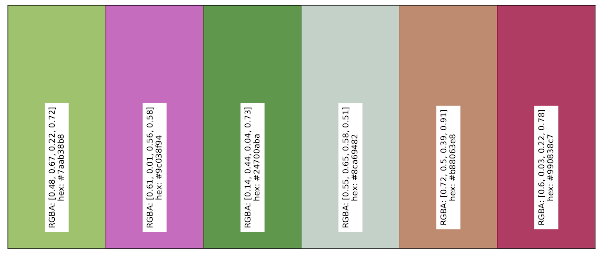
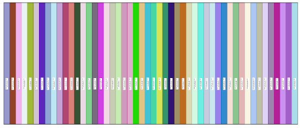

# Color Palette Creator

## General comments

When a lot of data needs to be present on a plot, it's generally advisable to 
change the way the data is presented. But if this is not possible, 
it's best to use clearly distinguishable colors. 

That's why this tool was created: `color_palette_creator` is able to generate random palettes of colours. 
These palettes can be used in the context of plots, and generally improve their readability.
The colours are generated such that they are visible on a white background 
and are not too similar to any of the other colours in the set.

This code follows the style convention established in the [PEP8 document](https://peps.python.org/pep-0008/).

Version 1.2.0

## Content

This version contains a basic generator, available in the `basic_generator` folder, and a 
color map generator, stored in `cmap_generator`.

-----

### Basic Generator

The principle of the scripts contained in `basic_generator` is the following: 
* run `python main.py`
* specify the number of colours that you would like to generate
* obtain a plot to see the colours
	* if required, generate as many times as you want another plot (all colour codes are printed on the terminal)
	* if you are satisfied with the colours, save the codes in a `.txt` file, and save the figure in a `.pdf` file

##### Colour palette with 6 colours

  

##### Colour palette with 50 colours

   

#### Remarks

* A class hierarchy has been established for the sole purpose of making it an exercise. 

-----

### Cmap Generator

Colour maps can be generated in `cmap_generator`, and used in any plot. 
The `main.py` script contains already some examples of initialization of functions, so that
the user can copy the example and create their own colour map. 

##### Colour maps

  

