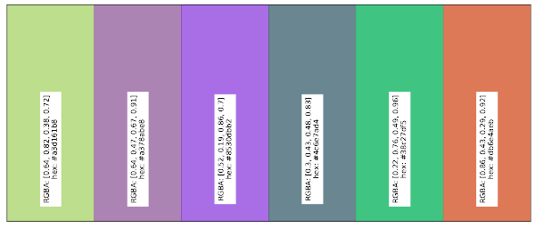
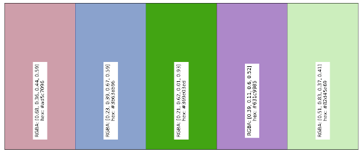
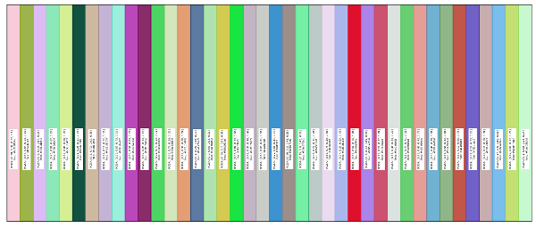
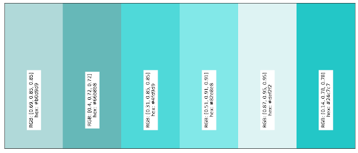
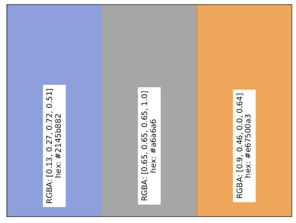
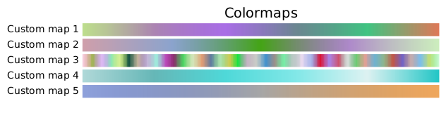

# Color Palette Creator

## General comments

When a lot of data needs to be on a plot, it's generally advisable to 
change the way the data is presented. But if this is not possible, 
it's best to use distinguishable colours. 

That's why this tool was created: `color_palette_creator` is able to 
generate random palettes of colours. These palettes can be used in the 
context of plots, and generally improve their readability.

The colours are generated in such a way that they are visible on a white 
background and are not too similar to any of the other colours in the set.

This code follows the style convention established in the 
[PEP8 document](https://peps.python.org/pep-0008/).

Version 2.0.1

## Content

This version no longer contains a basic and a colour map generator 
(See versions 1.x.x). 
From version 2.x.x on, `color_palette_creator` is a package, which is 
able to directly create palettes and colour maps, using respectively 
`get_palette` and `get_cmap`.

Tests are available in `src/color_palette_creator/tests/`

An additional set of plotting tools are added in the package. The colour 
palettes and maps can be plotted with `plot_palette` and `plot_cmaps`, and
saved with `save_fig`.

## Installation 

Clone this repository to a desired location, `cd` in the 
`color_palette_creator` folder, then do `pip install`.

-----

### Palette Generator

Colour palettes are generated using `get_palette`. This functions takes 
several arguments. While most of them are set by default, the number of 
generated colours will always have to be set by the user.
```
get_palette(6)
```

A `key` argument has been added such that the user can specify a python colour
for which a palette will be created. In this case, it is recommanded to lower
the `lim_sum` value, which is set by default at 0.5.
```
get_palette(6, 'teal', lim_sum=0.2)
```

##### Palettes

 
 
 
 
 

-----

### Cmap Generator

Colour maps are created using `get_cmap`. In this case, there are two main 
arguments in this function: the colour palette, and the number of colours
generated in total to create the colour map. 
The colour palette can either be specified using the RGB, RGBA or HEX convention.
```
get_cmap([(0.0, 1.0, 1.0), (0.5, 0.5, 1.0)], n_bins=600)
```

The number of bins can be changed to match the number of colours, and hence
create a discrete colour map.
```
get_cmap(['#2145b882', '#a6a6a6', '#e67500a3'], n_bins=3)
```

The colour palette can also of course be generated with `get_palette`
```
get_cmap(get_palette(6), n_bins=600)
```
```
get_cmap(get_palette(40), n_bins=40)`
```


##### Colour maps

  


-----

### Example

``` Python
from color_palette_creator import get_palette, get_cmap, plot_palette, plot_cmaps, save_fig


# Create a palette
palettes = [get_palette(6), get_palette(5), get_palette(40),
            get_palette(6, 'teal', lim_sum=0.2),
            ['#2145b882', '#a6a6a6', '#e67500a3']]

palette_plot = []
for pal in palettes:
    palette_plot.append(plot_palette(pal))

for p, plot in enumerate(palette_plot):
    save_fig(plot, f'color_palette_creator/tests/figures/test_palette_{p}')

# Create a cmap
cmaps = [get_cmap(pal, n_bins=600) for pal in palettes]

cmap_plot = plot_cmaps(cmaps)

save_fig(cmap_plot, 'color_palette_creator/tests/figures/test_cmap')

```


